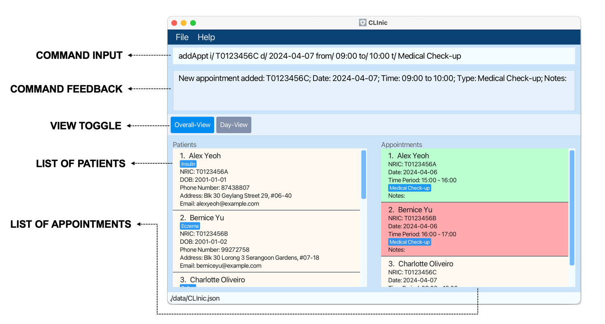
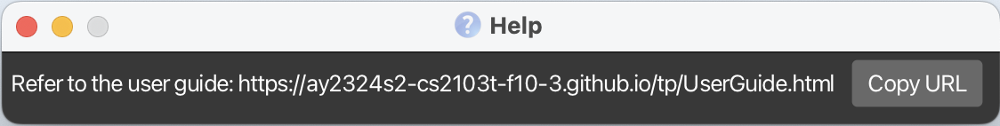
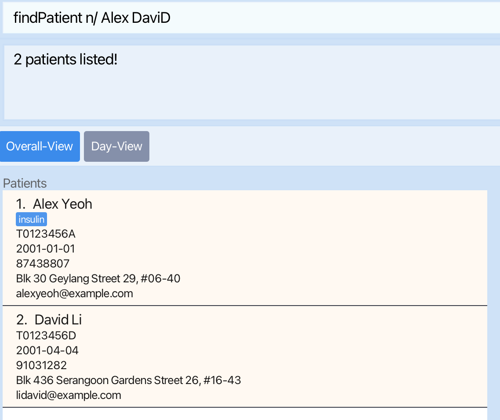

# CLInic User Guide

Welcome to **CLInic**, your digital assistant for managing patients and appointments! CLInic is a desktop app designed for clinic assistants, optimized for use via a Command Line Interface (CLI) while still offering the benefits of a Graphical User Interface (GUI).    If you're familiar with digitalized software or have used a CLI before, you'll find CLInic intuitive. Don't worry if you're new to CLI; we'll guide you through every step.

As part of our Beta Testing, we would greatly appreciate feedback from actual users. Help us improve CLInic together [**here**](https://forms.gle/RSBeinMHPMYXyYyGA)!

<!-- * Table of Contents -->
<page-nav-print />

--------------------------------------------------------------------------------------------------------------------

## Quick start

1. System Requirements: Ensure you have [**Java 11**](https://www.oracle.com/java/technologies/downloads/#java11) or above installed on your computer.

1. Download the latest `CLInic.jar` from [**here**](https://github.com/AY2324S2-CS2103T-F10-3/tp/releases).

1. Save the file to a location on your computer that will serve as your home folder for CLInic.

1. Open a command terminal on your computer. If you're unsure how to do this, we'll walk you through it.
   * **Windows**: Press `Win + R`, type `cmd`, and press `Enter`.
   * **MacOS**: Press `Cmd + Space`, type `Terminal`, and press `Enter`.
   * **Linux**: Press `Ctrl + Alt + T`.

1. Navigate to the folder where you saved the `CLInic.jar` file. If you saved it in your `Downloads` folder, you can use the following commands:
   * **Windows**: `cd Downloads`
   * **MacOS**: `cd ~/Downloads`
   * **Linux**: `cd ~/Downloads`

1. Type `java -jar CLInic.jar` command into terminal to run the application. 
      A GUI similar to the below should appear in a few seconds. Note how the app contains some sample data. 
      

1. Type the command in the command box and press Enter to execute it. e.g. typing **`help`** and pressing Enter will open the help window. 
   Some example commands you can try:

   * `list` : Lists all patients and appointments.

   * `addPatient i/T0123456A n/John Doe b/2001-05-02 p/98765432 e/johnd@example.com a/John street, block 123, #01-01` : Adds a contact named `John Doe` to CLInic.

   * `deletePatient T0123456A` : Deletes patient with NRIC T0123456A and corresponding appointments.

   * `clear` : Deletes all patients and appointments.

   * `exit` : Exits the app.

1. Refer to the [**Features**](#features) below for details of each command.

--------------------------------------------------------------------------------------------------------------------

## Features

<box type="info" seamless>

**Notes about the command format:** 

* Words in `UPPER_CASE` are the parameters to be supplied by the user. 
  e.g. in `addPatient n/NAME`, `NAME` is a parameter which can be used as `addPatient n/John Doe`.

* Items in square brackets are optional. 
  e.g `n/NAME [t/TAG]` can be used as `n/John Doe t/friend` or as `n/John Doe`.

* Items with `…`​ after them can be used multiple times including zero times. 
  e.g. `[t/TAG]…​` can be used as ` ` (i.e. 0 times), `t/friend`, `t/friend t/family` etc.

* Parameters can be in any order. 
  e.g. if the command specifies `n/NAME p/PHONE_NUMBER`, `p/PHONE_NUMBER n/NAME` is also acceptable.

* Extraneous parameters for commands that do not take in parameters (such as `help`, `list`, `exit`, `switchView` and `clear`) will be ignored. 
  e.g. if the command specifies `help 123`, it will be interpreted as `help`.

* If you are using a PDF version of this document, be careful when copying and pasting commands that span multiple lines as space characters surrounding line-breaks may be omitted when copied over to the application.
</box>

### Viewing help : `help`

Shows a message explaining how to access the help page.

Format: `help`

### Adding a patient: `addPatient` OR `ap`

Adds a patient to CLInic.

Format: `addPatient i/NRIC n/NAME b/DOB p/PHONE_NUMBER e/EMAIL a/ADDRESS [t/TAG]…​`  
Shorthand: `ap i/NRIC n/NAME  b/DOB p/PHONE_NUMBER e/EMAIL a/ADDRESS [t/TAG]…​`

* Names must consist of only english alphanumeric characters
* NRIC should start and end with capital letters with 7 numbers in between them, there is otherwise
  no additional checks for what makes a valid NRIC, eg. `S0123456A` will work
* Phone must be a Singapore-based phone number with 8 digits and starts with 6, 8 or 9

<box type="tip" seamless>

**Tip:** A patient must have a unique NRIC in CLInic.

</box>

Examples:
* `addPatient i/T0123456A n/John Doe b/2001-05-02 p/98765432 e/johnd@example.com a/John street, block 123, #01-01`
* `addPatient i/S1234567A n/Betsy Crowe b/2001-02-03 t/friend e/betsycrowe@example.com a/Newgate Prison p/91234567 t/criminal`
* `ap i/S1234567A n/Betsy Crowe b/2001-02-03 t/friend e/betsycrowe@example.com a/Newgate Prison p/91234567 t/criminal`

### Deleting a patient : `deletePatient` OR `dp`

Deletes the specified patient (identified by NRIC) from CLInic.
Corresponding appointments for the specified patient will be deleted too.

Format: `deletePatient i/NRIC`  
Shorthand: `dp i/NRIC`

* Deletes the patient and corresponding appointments with specified `NRIC`.
* The patient with specified NRIC **must exist within database**.

Examples:
* `deletePatient i/S1234567A` deletes the patient with NRIC S1234567A in CLInic.

### Editing a patient : `editPatient` OR `ep`

Edits an existing patient in CLInic.

Format: `editPatient i/NRIC [newn/NEW_NAME] [newb/NEW_DOB] [newp/NEW_PHONE] [newe/NEW_EMAIL] [newa/NEW_ADDRESS] [newt/NEW_TAG]…​`  
Shorthand: `ep i/NRIC [newn/NEW_NAME] [newb/NEW_DOB] [newp/NEW_PHONE] [newe/NEW_EMAIL] [newa/NEW_ADDRESS] [newt/NEW_TAG]…​`

* Edits the patient with the specified NRIC.
* The patient with specified NRIC **must exist within database**.
* Provide at least one optional field for editing.
* Existing values will be updated to the input values.
* When editing tags, existing tags of the patient will be removed, i.e., adding tags is not cumulative. Use t/ to remove all tags.

Examples:
*  `editPatient i/T0123456A newp/91234567 newe/johndoe@example.com` Edits the phone number and email address of the patient with NRIC:`T0123456A` to be `91234567` and `johndoe@example.com` respectively.
*  `editPatient i/S8765432Z newn/Betsy Crower newt/` Edits the name of the patient with NRIC:`S8765432Z` to be `Betsy Crower` and clears all existing tags.
*  `ep i/S8765432Z newn/Betsy Crower newt/`

### Locating patients: `findPatient` OR `fp`

Finds patients whose name OR NRIC fit the given keywords.

Format: `findPatient n/NAME_KEYWORD [MORE_NAME_KEYWORDS]` OR `findPatient i/NRIC_KEYWORD`  
Shorthand: `fp n/NAME_KEYWORD [MORE_NAME_KEYWORDS]` OR `fp i/NRIC_KEYWORD`

* Only the name OR NRIC is searched at once. e.g. `n/Bob i/T0123456A` is illegal
* The search is case-insensitive. e.g `hans` will match `Hans`
* Partial words will be matched only if the start of the word is the same e.g. `Han` will match `Hans`

Name Search
* The order of the keywords does not matter. e.g. `Hans Bo` will match `Bo Hans`
* Patients matching at least one keyword will be returned (i.e. `OR` search).
  e.g. `n/Hans Bo` will return `Hans Gruber`, `Bo Yang`

NRIC Search
* Only patients matching the given keyword will be returned.
  e.g. `n/T0` will return `T0123456A`, `T0234567B`
  e.g. `n/T01 T012` will NOT return `T0123456A` as the given keyword is `T01 T012`

Examples:
* `findPatient i/S9` returns patients with NRICs `S9876543A` and `S9765432A`
* `findPatient n/John` returns patients with names `john` and `John Doe`
* `findPatient n/alex david` returns patients with names `Alex Yeoh`, `David Li` 
* `fp n/ alex david` returns patients with names `Alex Yeoh`, `David Li` 

  

### Adding an Appointment: `addAppt` OR `aa`

Adds an appointment to the CLInic.

Format: `addAppt i/NRIC d/DATE from/START_TIME to/END_TIME t/APPOINTMENT_TYPE [note/NOTE]`  
Shorthand: `aa i/NRIC d/DATE from/START_TIME to/END_TIME t/APPOINTMENT_TYPE [note/NOTE]`

* Adds an appointment for the patient with specified `NRIC`, on `DATE` from `START_TIME` to `END_TIME`
* Patient with this NRIC **must exist within database**.
* Details of `APPOINTMENT_TYPE` and `NOTE` will be captured for reference
* `note/` is an optional field

Examples:
* `addAppt i/T0123456A d/2024-02-20 from/11:00 to/11:30 t/Medical Check-up note/Routine check-in`
* `addAppt i/S1234567A d/2024-02-20 from/15:00 to/15:30 t/Blood Test note/Follow-up from last consultation`
* `aa i/S1234567A d/2024-02-20 from/15:00 to/15:30 t/Blood Test note/Follow-up from last consultation`

### Deleting an Appointment: `deleteAppt` OR `da`

Deleting an appointment from CLInic.

Format: `deleteAppt i/NRIC d/DATE from/START_TIME`  
Shorthand: `da i/NRIC d/DATE from/START_TIME`

* Deletes an appointment for the patient with specified `NRIC`, on `DATE` from `START_TIME`.
* Appointment with the stated details **must exist within database**.
* `END_TIME` not needed as same patient can never have overlapping appointments, hence `START_TIME` is unique

Examples:
* `deleteAppt i/S8743880A d/2024-02-20 from/11:00`
* `da i/S8743880A d/2024-02-20 from/11:00`

### Editing an Appointment : `editAppointment` OR `ea`

Edits an existing appointment in CLInic.

Format: `editAppt i/NRIC d/DATE from/START_TIME [newd/NEW_DATE] [newfrom/NEW_START_TIME] [newto/NEW_END_TIME] [newt/NEW_APPOINTMENT_TYPE] [newnote/NEW_NOTE]`  
Shorthand: `ea i/NRIC d/DATE from/START_TIME [newd/NEW_DATE] [newfrom/NEW_START_TIME] [newto/NEW_END_TIME] [newt/NEW_APPOINTMENT_TYPE] [newnote/NEW_NOTE]`

* Edits the appointment with the specified NRIC, DATE and START_TIME.
* Ensure the NRIC is valid and exists in the system.
* Provide at least one optional field for editing.
* Existing values will be updated to the input values.

Examples:
*  `editAppt i/T0123456A d/2024-02-20 from/11:00 newd/2024-02-21`
  * Edits the date of the appointment with NRIC:`T0123456A`, DATE: `2024-02-20`, START_TIME: `11:00`, to be `2024-02-21` instead.
*  `editAppt i/S8743880A d/2024-10-20 from/14:00 newnote/ `
  * Clears note for appointment with NRIC:`S8743880A`, DATE: `2024-10-20`, START_TIME: `14:00`.
*  `ea i/S8743880A d/2024-10-20 from/14:00 newnote/ `

### Finding appointments: `findAppt` OR `fa`

Finds appointments based on the given parameters.

Format: `findAppt [i/NRIC] [d/DATE] [from/START_TIME]`
Shorthand: `fa [i/NRIC] [d/DATE] [from/START_TIME]`

* Filters an appointment with specific `NRIC`, `DATE` or `START_TIME` (any combination of the 3)
* If invalid parameters, error detailing what went wrong will be displayed.
* For argument concerning TIME, all appointments that start at the given time and later than that are returned.
* Fetching for TIME without DATE will return all appointments whose start from that time or later than that on any date.

Examples:
* `findAppt d/ 2024-02-20 from/ 11:00`
* `fa d/ 2024-02-20 from/ 11:00`
*  returns you all appointments on `2024-02-20` starting from `11:00` and later.

### Marking an Appointment: `mark`

Marks an appointment from the address book.

Format: `mark i/NRIC d/DATE from/START_TIME`

* Marks an appointment for the patient with specified `NRIC`, on `DATE` from `START_TIME`
* Appointment with the stated details **must exist within database**.
* `END_TIME` not needed as same patient can never have overlapping appointments, hence `START_TIME` is unique

Examples:
* `mark i/T0123456A d/2024-02-20 from/11:00`

### Unmarking an Appointment: `unmark`

Unmarks an appointment from the address book.

Format: `unmark i/NRIC d/DATE from/START_TIME`

* Unmarks an appointment for the patient with specified `NRIC`, on `DATE` from `START_TIME`
* Appointment with the stated details **must exist within database**.
* `END_TIME` not needed as same patient can never have overlapping appointments, hence `START_TIME` is unique

Examples:
* `unmark i/T0123456A d/2024-02-20 from/11:00`

### Listing all patients and appointments : `list` OR `ls`

Shows a list of all patients and appointments in CLInic.

Format: `list` OR `ls`

### Switch between Overall View and Day View : `switchView` OR `sv`

Switches view from Overall View to Day View or vice versa.

Format: `switchView` OR `sv`

### Clearing all entries : `clear`

Clears all entries of patients and appointments from CLInic.

Format: `clear`

### Exiting the program : `exit`

Exits the program.

Format: `exit`

### Saving the data

CLInic data are saved in the hard disk automatically after any command that changes the data. There is no need to save manually.

### Editing the data file

CLInic data are saved automatically as a JSON file `[JAR file location]/data/CLInic.json`. Advanced users are welcome to update data directly by editing that data file.

<box type="warning" seamless>

**Caution:**
If your changes to the data file makes its format invalid, CLInic will discard all data and start with an empty data file at the next run.  Hence, it is recommended to take a backup of the file before editing it. 
Furthermore, certain edits can cause the CLInic to behave in unexpected ways (e.g., if a value entered is outside the acceptable range). Therefore, edit the data file only if you are confident that you can update it correctly.
</box>

--------------------------------------------------------------------------------------------------------------------

## FAQ

**Q**: How do I transfer my data to another Computer? 
**A**: Install the app in the other computer and overwrite the empty data file it creates with the file that contains the data of your previous CLInic home folder.

--------------------------------------------------------------------------------------------------------------------

## Known issues

1. **When using multiple screens**, if you move the application to a secondary screen, and later switch to using only the primary screen, the GUI will open off-screen. The remedy is to delete the `preferences.json` file created by the application before running the application again.

--------------------------------------------------------------------------------------------------------------------

## Glossary
| Term                 | Explanation                                                                                                                                    |
|----------------------|------------------------------------------------------------------------------------------------------------------------------------------------|
| **CLI**              | Command Line Interface, a text-based interface for interacting with software by typing commands.                                               |
| **GUI**              | Graphical User Interface, a visual interface that allows users to interact with software using graphical elements such as windows and buttons. |
| **JSON**             | JavaScript Object Notation, a lightweight data-interchange format.                                                                             |
| **NRIC**             | National Registration Identity Card, a unique identifier for individuals in Singapore.                                                         |
| **TAG**              | A keyword or term assigned to a piece of information, making it easier to search for and organize.                                             |
| **APPOINTMENT_TYPE** | The type of appointment, e.g., Medical Check-up, Blood Test, etc.                                                                              |
| **NOTE**             | Additional information or comments about an appointment.                                                                                       |

--------------------------------------------------------------------------------------------------------------------

## Command summary
| Action            | Format, Examples                                                                                                                                                                                                                                     |
|-------------------|------------------------------------------------------------------------------------------------------------------------------------------------------------------------------------------------------------------------------------------------------|
| **AddPatient**    | `addPatient i/NRIC n/NAME b/DOB p/PHONE_NUMBER e/EMAIL a/ADDRESS [t/TAG]…​`   e.g., `addPatient i/T0123456A n/John Doe b/2001-05-02 p/98765432 e/johnd@example.com a/John street, block 123, #01-01`                                              |
| **DeletePatient** | `deletePatient i/NRIC`  e.g., `deletePatient i/T0123456A`                                                                                                                                                                                             |                                                                 |
| **EditPatient**   | `editPatient i/NRIC [newn/NEW_NAME] [newp/NEW_PHONE_NUMBER] [newe/NEW_EMAIL] [newa/NEW_ADDRESS] [newt/NEW_TAG]…​`  e.g.,`editPatient i/T0123456A newn/James Lee newe/jameslee@example.com`                                                            |
| **FindPatient**   | `findPatient n/ KEYWORD [MORE_KEYWORDS]` OR `findPatient i/ KEYWORD`  e.g., `findPatient n/ James Jake`                                                                                                                                           |
| **AddAppt**       | `addAppt i/NRIC d/DATE from/START_TIME to/END_TIME t/APPOINTMENT_TYPE note/NOTE`  e.g., `addAppt i/ T0123456A d/ 2024-02-20 from/ 11:00 to/ 11:30 t/ Medical Check-up note/ Routine check-in`                                                     |
| **DeleteAppt**    | `deleteAppt i/NRIC d/DATE from/START_TIME`   e.g., `deleteAppt i/ S8743880A d/ 2024-02-20 from/ 11:00`                                                                                                                          |
| **EditAppt**      | `editAppt i/NRIC d/DATE from/START_TIME [newd/NEW_DATE] [newfrom/NEW_START_TIME] [newto/NEW_END_TIME] [newt/NEW_APPOINTMENT_TYPE] [newnote/NEW_NOTE]`   e.g., `editAppt i/ T0123456A d/ 2024-02-20 from/ 11:00 newd/ 2024-02-21` |
| **FindAppt**      | `findAppt [i/NRIC] [d/DATE] [from/START_TIME]`   e.g., `findAppt i/ T0123456A d/ 2024-02-20 from/ 11:00`                                                                                                                                          |
| **Mark**          | `mark i/NRIC d/DATE from/START_TIME`   e.g., `mark i/ T0123456A d/ 2024-02-20 from/ 11:00`                                                                                                                                   |
| **Unmark**        | `unmark i/NRIC d/DATE from/START_TIME`   e.g., `unmark i/ T0123456A d/ 2024-02-20 from/ 11:00`                                                                                                                              |
| **List**          |`list`                                                                                                                                                                                                                                         
| **SwitchView**    | `switchView`
| **Clear**         | `clear`                                                                                                                                                                                                                                        |
| **Exit**          | `exit`                                                                                                                                                                                                                                               |
| **Help**          | `help`                                                                                                                                                                                                                                               |
